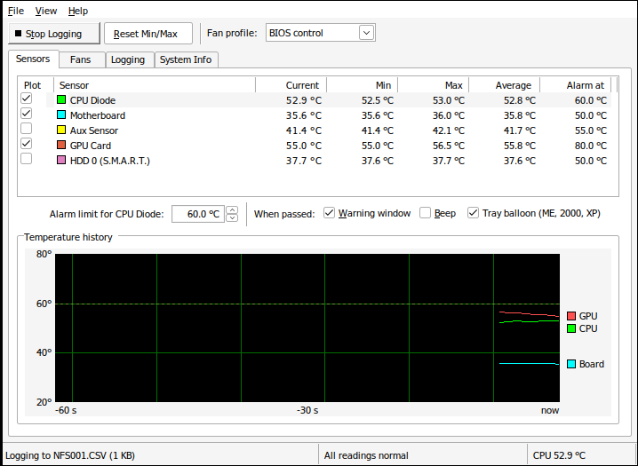
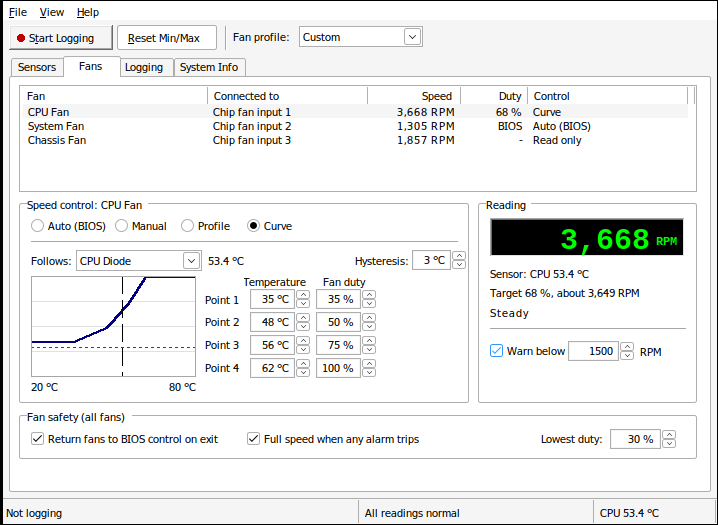
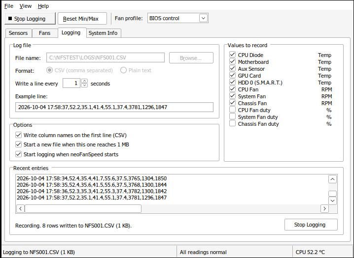
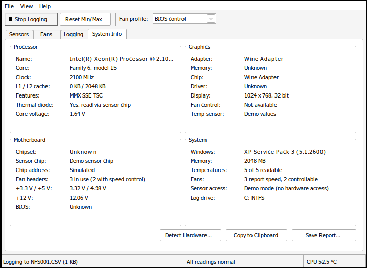
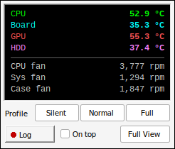

# neoFanSpeed

A small temperature and fan speed monitor for Windows 98, 98SE, ME, 2000
and XP. One program file, `NEOFAN.EXE`, runs on all of them.

Current version: **3.3**. See [Version history](#version-history).



## What it does

- **Sensors tab**: CPU diode, motherboard, a third board sensor, the
  graphics chip (NVIDIA cards, through the driver's `NVCPL.DLL`) and the hard
  disk (S.M.A.R.T.) temperature, with current, lowest, highest and average
  values, an alarm limit per sensor and a 60 second history graph.
- **Fans tab**: speed of up to three fans. When the sensor chip can drive a
  fan, you can pick Auto (BIOS), Manual (a fixed duty), Profile (Silent,
  Normal, Full speed) or Curve (four points with hysteresis). Fans the chip
  cannot drive are shown as read only, with the reason.
- **Fan safety**: a lowest duty floor, full speed on any alarm (with a
  Restore My Settings button) and hand back to the BIOS on exit.
- **Logging tab**: writes CSV or plain text every 1 to 60 seconds, picks the
  columns, starts a new file at 1 MB (`NFS001.CSV`, `NFS002.CSV`, ...).
- **System Info tab**: CPU name, core, clock and cache, graphics adapter,
  chipset, BIOS, sensor chip, voltages, Windows version, total and free
  memory, drives that report a temperature, and the file system and free
  space of the log drive. Copy to Clipboard and Save Report.
- **Mini View**, a tray icon that shows the temperature, a tray menu and,
  on ME, 2000 and XP, alarm balloons.

| Fans, curve mode | Logging | System Info | Mini View |
|---|---|---|---|
|  |  |  |  |

## What works on which Windows

| | 98 / 98SE / ME | 2000 / XP |
|---|---|---|
| CPU, graphics, chipset, BIOS, memory details | yes | yes |
| Board temperatures, fan speeds, voltages | yes, with a supported chip | no, see below |
| Fan control | yes, Winbond W83627HF and W83697HF | no |
| Hard disk temperature (S.M.A.R.T.) | yes, needs `SMARTVSD.VXD` | yes, run as administrator |
| Logging, Mini View, tray icon | yes | yes |
| Alarm balloons | ME only | yes |

**Why 2000 and XP get less.** The sensor chip sits on old ISA ports. Windows
98, 98SE and ME let a normal program read those ports. Windows 2000 and XP
block that and need a kernel driver, and neoFanSpeed does not ship one. On
those versions it says so in a banner, keeps the CPU, graphics and disk
readings and turns the fan controls off. Nothing is written to the hardware.

**Supported sensor chips** (found through the Super I/O ports 2Eh and 4Eh,
or at 290h on older boards):

- Winbond W83627HF, W83697HF: temperatures, fans, voltages, fan control on
  fan inputs 1 and 2.
- Winbond W83627THF, W83637HF, W83781D, W83782D, W83783S and ITE IT8705F,
  IT8712F: temperatures, fans and voltages, read only.
- Any other chip is named in a "not supported" banner with Save Chip Report.

Board makers wire sensors in their own way, so "CPU Diode" (chip
temperature 2) and "Motherboard" (temperature 1) may be swapped on some
boards. Names can be changed in `NEOFAN.INI` (`[Sensor1]` to `[Sensor5]`,
`[Fan1]` to `[Fan3]`, key `Name`).

The chip counts fan speed with an 8 bit counter, so each fan has a slowest
speed it can count, set by the BIOS (2,647 RPM with the common divisor of
2). Below that the program shows, for example, "<2,647" and cannot tell a
slow fan from a stopped one, so the low speed warning only trips when that
slowest speed is at or under the warning limit. neoFanSpeed leaves the
divisor as the BIOS set it.

Fan control writes the chip's PWM duty register. The value the BIOS left
there is saved first and put back on Auto (BIOS) and on exit, unless you
untick "Return fans to BIOS control on exit".

## Running it

A ready build is in [`build/NEOFAN.EXE`](build/NEOFAN.EXE). Copy it to any folder and start it. Settings go to `NEOFAN.INI`
in the same folder. The first start shows the hardware scan.

- `NEOFAN.EXE /demo` shows simulated readings, to try every screen on any PC.
- `NEOFAN.EXE /nohw` skips the sensor chip on 98 and ME.

The default log file is `C:\NEOFAN\NFS001.CSV`. Names stay in the 8.3 form,
so they work on FAT, FAT32 and NTFS, and a log never grows past 2 GB, under
the FAT32 4 GB file limit.

## Building

On Linux (Debian or Ubuntu):

```sh
sudo apt-get install gcc-mingw-w64-i686 binutils-mingw-w64-i686 make python3
make          # builds build/NEOFAN.EXE
make check    # checks the program will load on Windows 98
```

The program is plain C and the Win32 API. It links no C runtime, so its
only imports are `KERNEL32`, `USER32`, `GDI32`, `ADVAPI32`, `COMCTL32`,
`COMDLG32` and `SHELL32`, all as they ship with Windows 98. It is built for
the Windows 4.0 subsystem and for a 486 or better CPU (no CMOV, MMX or SSE).
Newer calls (balloons, XP themes, `EnumDisplayDevices`) are looked up at run
time and skipped when missing.

`tools/make_icon.py` rebuilds `res/app.ico` from the two SVG files, with
16 and 256 color images that 98 and ME can show.

## Tests

- `make check` runs `tools/check_pe.py`: PE header (subsystem and OS version
  4.0, alignment, no TLS), every imported function against
  `tools/win98_api.txt` (calls Windows 98 exports), and the code for
  instructions newer than the Pentium.
- `tests/wine_smoke.sh build/NEOFAN.EXE out/` starts the program under Wine
  set to report Windows 98, ME, 2000 and XP, in demo mode and with real
  hardware access, takes a screenshot, and checks that the log file has a
  header and rows. Add a third argument to log onto another drive, for
  example a mounted FAT32 or NTFS image. `ROLLTEST=1` starts with a full
  1 MB log and checks that `NFS002.CSV` is made.
- `tests/fat32_fuse.py` mounts a FAT32 image through a user space FAT driver,
  for machines where the kernel FAT driver is not available.

Wine is not real Windows. These tests show the program loads, draws and
logs with each version's settings. They cannot reach a real sensor chip, and
the final check is a run on a real 98, ME, 2000 or XP machine.

## Version history

### 3.3

- GPU temperature on NVIDIA cards. The program asks the NVIDIA driver
  (`NVCPL.DLL`) for the core temperature. It shows on the Sensors tab, the
  graph and the log like any other sensor. Other cards, and
  NVIDIA drivers without this call, show "n/a" as before.
- Manual mode marks the safety floor on the slider, and shows a red note
  when the fan runs below it.
- The graph draws the alarm limit as a red dotted line. The curve editor
  shows its four points as handles and the current temperature as a red
  dotted line.
- System Info shows free memory, how many drives report a S.M.A.R.T.
  temperature, and free space on the log drive. The CPU core line adds the
  stepping. The saved report has the same new lines.
- Demo mode starts with a full minute of graph history.

### 3.2

- A fan that turns too slowly for the sensor chip to count now shows as
  "<2,647 rpm" (the slowest speed the chip can count) instead of 0 RPM.
  In 3.1 a slow fan on Silent could read 0 RPM, set off the fan alarm and
  jump to full speed. The alarm now trips only when that slowest countable
  speed is at or under the warning limit, so it is sure the fan is too
  slow. The CSV log writes these readings as `<2647`.
- The alarm window keeps the reading of the alarm it shows when a second
  alarm trips while it is open.
- The tray icon is only redrawn when its number or color changes.
- Hard disk temperature (S.M.A.R.T.) is read every 30 seconds instead of
  every 5.
- Tab and the arrow keys now move between the buttons in Mini View.
- Log file names with long numbers (more than 9 digits) no longer
  overflow when the log rolls to a new file.

### 3.1

- The low fan speed warning now works like the temperature alarm: it
  beeps, opens the alarm window, shows a balloon and, with "Full speed
  when any alarm trips" ticked, sets the fans to full speed.
- A fan that stops after start now shows 0 RPM and sets off its warning,
  instead of dropping out of the list.
- Fan control on the Winbond W83697HF now writes the right registers (01h
  and 03h).
- Mini View no longer loses a drawing pen on each repaint, which could use
  up Windows 98 and ME graphics memory over a long run.
- Dashed and dotted graph lines (GPU, Aux, HDD) now show as dashes and dots.
- Long log or report paths no longer overflow the status and error text.
- After `NFS999.CSV` the log keeps writing to that file instead of starting
  over at `NFS000.CSV`.
- A saved fan duty below the lowest duty now loads as the lowest duty, so
  the screen matches the fan.
- The low duty question waits until you let go of the slider.
- Any ITE IT87xx chip is now named in the "not supported" banner.

### 3.0

- First release: Sensors, Fans, Logging and System Info tabs, Mini View,
  tray icon, alarms and logging to CSV or text.
